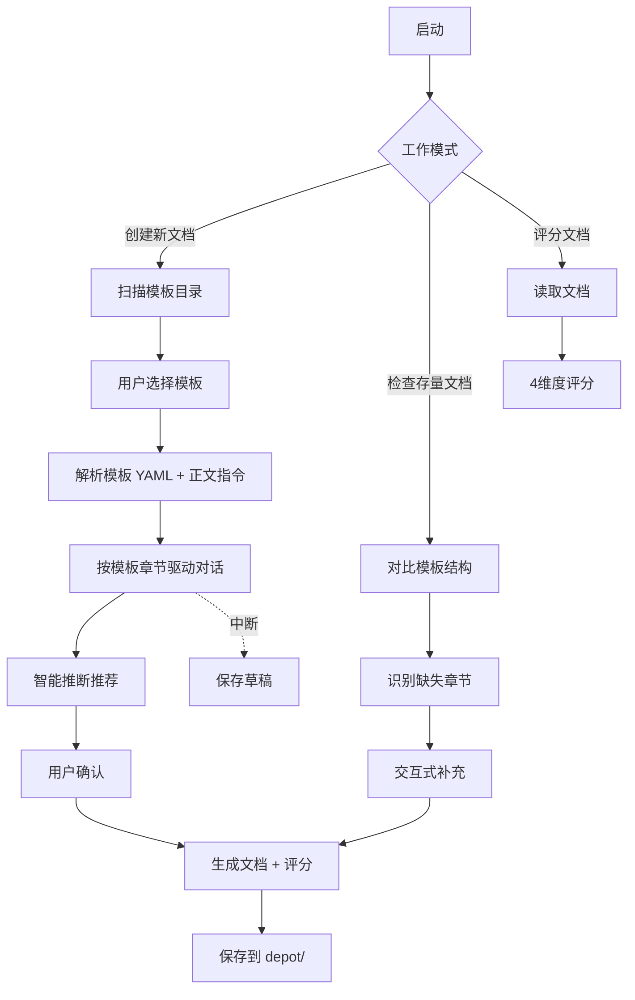

# Spec Writer 工作技能

Spec Writer 是一个**对话式文档编写助手**，通过自然语言交互帮助开发者完成工程规范文档的创建、检查和优化。

> **核心设计**：spec-writer 是**执行容器**，具体的文档类型引导问题和交付标准来自 `templates/*.template.md`。本文件定义通用的执行机制，模板文件定义特定文档类型的内容和流程。

## 主要功能

1. **对话式创建文档**：读取模板 → 按章节引导对话 → 生成文档
2. **存量文档检查**：对比模板结构 → 识别缺失章节 → 交互式补充
3. **文档质量评分**：4 维度 10 分制评分 + 改进建议
4. **草稿管理**：JSON 格式保存/恢复，支持断点续写
5. **智能推断推荐**：基于前置知识推荐内容，用户确认后写入
6. **多模板支持**：自动扫描 `templates/` 目录，支持任意模板

---

## 工作流概览



### 三阶段创建流程

```
阶段 1：准备
├─ Step 0: 扫描 templates/ → 用户选择模板
├─ Step 1: 提供前置知识（父文档/代码库）— 强烈推荐，准确度 60% → 90%+
├─ Step 2: 展示计划概要（从模板提取章节列表）
└─ Step 3: 用户确认

阶段 2：对话式创建
├─ Step 4-N: 按模板章节逐一对话
│   ├─ 从模板 [填写说明] 提取引导问题
│   ├─ 遇到（spec-writer 指令）标记时执行特殊行为
│   ├─ 智能推断推荐（需用户确认）
│   └─ 可随时保存草稿
└─ Step N+1: 完整性检查

阶段 3：文档生成
├─ Step N+2: 生成到 depot/{team}/{project}/
└─ Step N+3: 评分 + 改进建议
```

---

## 模板→执行引擎 协议

spec-writer 从模板文件中提取工作指令，驱动整个对话流程：

| 模板标记 | 所在位置 | 执行引擎行为 |
|---------|---------|------------|
| `supported_sections: [...]` | YAML frontmatter | 确定对话轮次数和章节名 |
| `[填写说明]` | Markdown 正文（粗体标记） | 作为每轮对话的引导提示 |
| `（spec-writer 指令）` | 章节标题中的标记 | 触发特殊行为（推荐、校验、跳过、图表等） |
| `output_mode: "sharded"` | YAML frontmatter | 分片输出 vs 单文件输出 |
| `shards: [...]` | YAML frontmatter | 分片定义、依赖、条件跳过 |
| `condition: "..."` | shards[].condition | 条件跳过判断 |
| `depends_on: [...]` | shards[].depends_on | 确定生成顺序 |
| `output_artifacts` | YAML frontmatter | 附加产物（metadata.json, changelog.jsonl） |
| `version_policy` | YAML frontmatter | 版本管理策略 |

### 模板扫描规则

优先使用脚本获取确定性结果：`python3 scripts/scan_templates.py [--dir templates/]`

脚本返回 JSON 数组，包含每个模板的 `name`、`description`、`version`、`output_mode`、`supported_sections` 等字段。如脚本不可用，降级为手动 Glob + Read 解析。

### 对话驱动规则

按模板的 `supported_sections` 顺序逐一对话。每个章节：

1. 从模板正文中找到该章节对应的 `[填写说明]`，作为引导提示
2. 检查该章节是否有 `（spec-writer 指令）` 标记 → 有则执行指令描述的特殊行为
3. 尝试基于前置知识智能推断 → 展示推荐 → 用户确认/调整/拒绝
4. 检查是否可以跳过（如 CLI 项目跳过 UI/UX）
5. 记录完成的章节

### 分片模板特殊规则

当 `output_mode: "sharded"` 时：

1. 按 `shards[].depends_on` 拓扑排序确定生成顺序
2. 每个分片前检查 `condition` → 满足则生成，不满足则标记 `skipped`
3. 每个分片生成后执行一致性校验（服务名、接口、数据实体、术语、PRD 覆盖）
4. 同步生成 `output_artifacts` 中定义的附加产物

---

## 对话交互机制

### 进度条

每个对话回合底部显示：

```
┌──────────────────────────────────────────┐
│ {当前章节} ({当前步骤}/{总步骤}), next: {下一章节} │
└──────────────────────────────────────────┘
```

### 用户交互命令

| 命令 | 作用 |
|------|------|
| `next` | 跳到下一个章节 |
| `summary` | 查看已完成章节的汇总 |
| `edit Q{n}` | 修改已回答的问题 |
| `back` | 返回上一个章节 |

### 推荐交互模式

遇到可推断内容时，展示推荐并让用户选择：

```
[智能推断 📘 来源于父文档]
  - 推荐内容 A
  - 推荐内容 B

选项：
  □ 接受推荐
  □ 调整后接受
  □ 手动输入
```

**原则**：推荐仅供参考，用户始终拥有最终决定权。

---

## 智能推荐原则

### 推荐触发时机

- 模板中有 `（spec-writer 指令）` 标记且标记内容涉及"推荐"或"选型"
- 模板中有 `[填写说明]` 且存在前置知识（父文档/代码库）

### 推荐输出格式（通用）

**主推荐方案**：

| 维度 | 推荐方案 | 推荐依据（PRD 指标） |
|------|---------|---------------------|
| ____ | ____ | ____ |

**置信度**：高 / 中 / 低

**备选方案**：至少 1 个（格式同上）

**权衡分析**：

| 维度 | 主推荐 | 备选 | 优势方 |
|------|--------|------|--------|
| 实现成本 | ____ | ____ | ____ |
| 验证成本 | ____ | ____ | ____ |
| 运维成本 | ____ | ____ | ____ |

各模板可通过 `（spec-writer 指令）` 块特化推荐维度（如 hld_backend 定义了架构选型、服务选型、协议选型的具体维度）。

### 前置知识影响

| 推断目标 | 无前置知识 | 有前置知识（父文档） |
|---------|----------|-------------------|
| 技术栈推荐 | 通用推荐（60%） | 继承父文档（90%+） |
| 功能范围 | 手动输入 | 自动排除已有功能 |
| 命名规范 | 手动输入 | 继承父文档规范 |
| 风险评估 | 通用风险列表 | 结合父文档已知风险 |

**允许使用 WebSearch** 获取最新技术方案和案例。

---

## 文档评分框架

### 评分体系（10 分制）

仅评估方案论证质量，不评估项目管理内容（工期、人力、里程碑交给 scrum_master）。

| 维度 | 权重 | 检查项 | 满分 |
|------|------|--------|------|
| **形式完整性** | 40% | 章节齐全、必填字段完整、YAML metadata 规范 | 4.0 |
| **内容逻辑性** | 30% | 无矛盾、定义清晰、叙事准确 | 3.0 |
| **可操作性** | 20% | 技术方案可落地、验收标准明确 | 2.0 |
| **文档规范** | 10% | 命名规范、路径规范、相关文档链接 | 1.0 |

### 问题分类

| 类型 | 说明 | 处理 |
|------|------|------|
| **必须修复** | 缺失核心章节、关键逻辑错误 | 生成时自动提示 |
| **建议改进** | 补充细节、优化表述 | 展示给用户，可选接受 |

---

## 草稿管理

### 草稿格式（JSON）

保存路径：`depot/{team}/{project}/drafts/draft-{timestamp}.json`

```json
{
  "draft_id": "draft-20260227-103000",
  "project_name": "{project}",
  "template_used": "{template_name}",
  "template_version": "{version}",
  "created_at": "2026-02-27T10:30:00Z",
  "last_modified": "2026-02-27T11:15:00Z",
  "progress": {
    "current_section": "{section_id}",
    "completed_sections": ["section_a"],
    "pending_sections": ["section_b", "section_c"]
  },
  "metadata": {
    "team": "{team}",
    "spec_type": "{type}",
    "parent_document": "{path}"
  },
  "content": { }
}
```

### 触发时机

- 用户中断对话时自动保存
- 用户显式请求保存

### 恢复流程

读取草稿 JSON → 展示进度概要 → 从断点章节继续对话。

---

## 文档边界

**spec-writer 聚焦**：方案论证

- BRD（为什么做）、PRD（做什么）、Design Spec（怎么做）
- 技术实施要点、技术债务、FAQ

**不属于 spec-writer**（交给 scrum_master）：

- 里程碑定义、任务排期、人力分配
- 交付验收标准、迭代规划
- 进度风险、资源风险

**智能推断边界**：

- 推荐：技术栈、数据模型、接口设计、技术风险
- 不推断：工期估算、人力分配、里程碑规划

---

## 文档命名与输出

### 命名规范

`{scope}_{project-name}_{type}_v{X.Y.Z}.md`

- 粒度：`project` / `feature` / `enhance` / `fix`
- 路径：`depot/{team}/{project}/{document-name}.md`

### 版本号（语义化）

- **MAJOR**：不兼容变更、重大架构重构
- **MINOR**：向后兼容新增（新章节、新功能）
- **PATCH**：修正错误、格式调整

### YAML Metadata

每个文档必须包含：`spec_version`、`spec_type`、`spec_name`、`project_name`、`team`、`description`、`compatible_with`、`last_updated`、`changelog`。

### 文档标题

根据文件名自动生成标题，替换模板中的 `{文档标题}` 占位符。
示例：`ci-health-tracker_project_overview_v1.0.0.md` → `# CI Health Tracker 项目概览`

---

## 可执行脚本（scripts/）

以下脚本用于确定性操作，通过 Bash 调用获取结果：

| 脚本 | 用途 | 调用时机 |
|------|------|---------|
| `scripts/scan_templates.py` | 扫描模板目录，输出 JSON | Step 0 选择模板时 |
| `scripts/score_document.py` | 文档评分（4维度10分制） | 文档生成完成后 |
| `scripts/generate_filename.py` | 生成标准化文件名 | 保存文档时 |
| `scripts/increment_version.py` | 语义化版本号递增 | 更新文档版本时 |

调用方式：`python3 scripts/<script>.py [args]`（工作目录为项目根目录）

---

## 详细参考（按需加载）

以下文件包含详细的流程说明和示例。当执行过程中需要时，按需 Read 加载：

- **对话流程示例**：[workflow_engine.md](references/workflow_engine.md) — Step 0-6 的完整交互示例
- **工程调研流程**：[engineering_research.md](references/engineering_research.md) — 棕地/绿地判断、标准/快速模式
- **用户场景推演**：[scenario_driven_design.md](references/scenario_driven_design.md) — 场景推演模板和流程
- **评分标准细则**：[scoring_criteria.md](references/scoring_criteria.md) — 各维度详细检查项

---

## 相关文件

- 模板目录：`templates/*.template.md`
- 模板使用指南：`templates/README.md`
- 示例文档：`templates/examples/`
