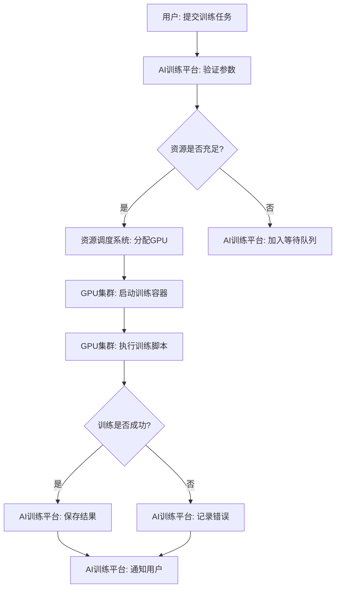
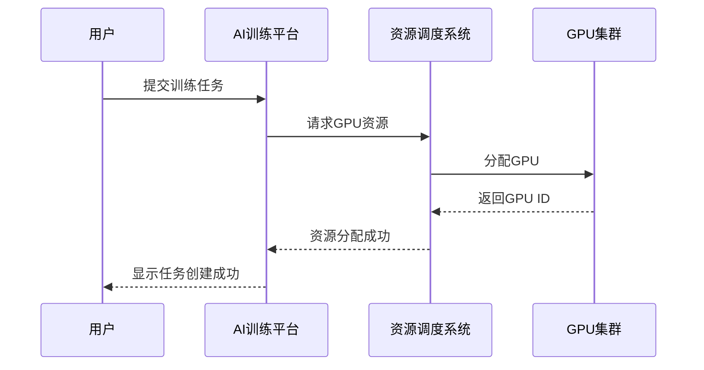

# {文档标题}

## 📚 前置知识（可选）

**是否有现有文档/代码/资源可供参考？**

提供前置知识后，spec-writer 可以基于现有内容智能推断，准确度提升 30%+。如果是新项目或无参考资料，可以跳过本章。

- **父文档/相关文档**：
  - 本地文档路径：[文档路径](____)
  - 在线文档 URL：[链接地址](____)

- **代码仓库**：
  - Git 仓库地址：[仓库链接](____)
  - 相关分支/Tag：____

- **技术栈文档**：
  - 官方文档：[文档链接](____)

- **参考资料**：
  - [参考资料 1](____)
  - [参考资料 2](____)

**[填写说明]**：
- 如果是基于现有系统的扩展功能，提供父文档路径
- 如果是新项目，可以留空
- 示例：`depot/devops/ci-health-tracker/ci-health-tracker_project_v1.0.0.md`

---

## 📋 第一部分：业务需求描述（BRD）

> **说明**：BRD（Business Requirement Document）回答"为什么做"的问题，描述业务背景、目标客户、预期收益和投入产出比。

### 1. 需求背景

- **业务痛点是什么？**
  - ____
  - ____

- **为什么要做这个事情？**
  - ____
  - ____

**[填写说明]**：描述当前业务面临的问题和挑战，说明为什么需要解决这个问题

---

### 2. 客户是谁

- **目标客户是谁？**
  - ____
  - ____

- **客户是否会为这个功能买单？**
  - ____
  - ____

- **我们能投入多少成本？**
  - 时间：____
  - 金钱：____
  - 人力：____

**[填写说明]**：明确客户群体和投入成本预算

---

### 3. 预期收益

- **收益是什么？**
  - ____
  - ____

- **谁会因此收益？**
  - ____
  - ____

- **收益规模多大？**
  - ____
  - ____

**[填写说明]**：量化收益指标（如用户增长、成本节约、效率提升等）

---

### 4. 是否值得做（ROI 分析）

- **投入产出比（ROI）分析**：
  - 投入成本：____
  - 预期收益：____
  - ROI = (收益 - 成本) / 成本 = ____

**[填写说明]**：评估项目是否值得启动，ROI 是否为正

---

## 📱 第二部分：产品需求描述（PRD）

> **说明**：PRD（Product Requirement Document）回答"做什么"的问题，定义功能范围、用户场景、功能需求和非功能需求。
> **重要**：本文档专注于业务和产品需求，不包含技术方案设计（前端/后端/数据库设计）。技术方案请参考 `all_in_one.template.md` 或独立的设计文档。

### 1. 功能范围/边界

#### 🎯 在范围内（In Scope）
- 功能 1：____
- 功能 2：____
- 功能 3：____

#### 🚫 不在范围内（Out of Scope）
- 暂不做的功能：____
- 后续版本考虑：____

**[填写说明]**：明确项目边界，避免范围蔓延

---

### 2. 用户画像

#### 目标用户
- **用户角色**：____（如：AI研究员、数据分析师、系统管理员）
- **用户特征**：
  - 技术背景：____
  - 使用场景：____
  - 痛点需求：____

#### 典型用户示例
- **用户A**：____（描述具体用户画像）
- **用户B**：____（描述具体用户画像）

**[填写说明]**：描述目标用户的特征和使用场景

---

### 3. 用户故事与功能需求

#### 3.1 用户故事列表

**用户故事 1**：作为 <用户角色>，我想要 <功能/行为>，以便 <达成目标>
- **业务场景**：____（描述在什么情况下使用）
- **对应功能需求**：F-001
- **验收标准**：
  - ✓ ____
  - ✓ ____
- **优先级**：P0

**用户故事 2**：作为 <用户角色>，我想要 <功能/行为>，以便 <达成目标>
- **业务场景**：____
- **对应功能需求**：F-002
- **验收标准**：
  - ✓ ____
  - ✓ ____
- **优先级**：P1

**用户故事 3**：作为 <用户角色>，我想要 <功能/行为>，以便 <达成目标>
- **业务场景**：____
- **对应功能需求**：F-003
- **验收标准**：
  - ✓ ____
  - ✓ ____
- **优先级**：P2

**[填写说明]**：
- 用户故事格式：作为 [用户角色]，我想要 [功能/行为]，以便 [达成目标]
- 业务场景：描述具体的业务使用场景
- 验收标准：定义完成的明确标准（Given-When-Then 格式）
- 优先级：P0（必须有）/ P1（应该有）/ P2（可以有）

---

#### 3.2 功能需求汇总表

| 功能编号 | 功能名称 | 用户故事 | 优先级 | 验收标准 |
|---------|---------|---------|-------|---------|
| F-001 | ____ | 用户故事 1 | P0 | ____ |
| F-002 | ____ | 用户故事 2 | P0 | ____ |
| F-003 | ____ | 用户故事 3 | P1 | ____ |
| F-004 | ____ | 用户故事 4 | P2 | ____ |

**[填写说明]**：汇总所有功能需求，便于整体查看和优先级管理

---

### 4. 非功能需求

#### 4.1 性能要求
| 场景 | 性能指标 | 目标值 |
|------|---------|--------|
| 场景 1：____ | 响应时间 | ____ |
| 场景 2：____ | 并发用户数 | ____ |
| 场景 3：____ | 吞吐量 | ____ |

**[填写说明]**：结合用户场景描述性能要求

---

#### 4.2 安全要求
| 场景 | 安全要求 | 实现方式 |
|------|---------|---------|
| 场景 1：用户认证 | ____ | ____ |
| 场景 2：权限控制 | ____ | ____ |
| 场景 3：数据加密 | ____ | ____ |

**[填写说明]**：结合用户场景描述安全要求

---

#### 4.3 可用性要求
| 场景 | 可用性指标 | 目标值 |
|------|-----------|--------|
| 场景 1：____ | 可用性目标 | ____（如 99.9%） |
| 场景 2：____ | 容错机制 | ____ |

**[填写说明]**：定义系统的可用性要求

---

#### 4.4 兼容性要求
| 场景 | 兼容性要求 | 说明 |
|------|-----------|------|
| 场景 1：浏览器支持 | ____ | ____ |
| 场景 2：平台兼容 | ____ | ____ |
| 场景 3：向后兼容 | ____ | ____ |

**[填写说明]**：定义系统的兼容性要求

---

## 📐 重要提示：强烈建议生成流程图/时序图

> **⚠️ 为什么需要流程图？**
>
> **PRD 文档通过文字描述了"做什么"，但流程图可以：**
> - ✅ **可视化复杂逻辑**：一眼看懂业务流程和决策分支
> - ✅ **明确参与者交互**：清晰展示用户角色与业务系统的交互顺序
> - ✅ **减少理解偏差**：避免不同人对需求的理解不一致
> - ✅ **便于评审沟通**：业务方、产品、开发团队达成共识
> - ✅ **发现逻辑漏洞**：通过画图发现异常流程和边界条件
>
> **建议的图表类型：**
> 1. **业务流程图**（Flowchart）：展示业务流程的步骤和决策点
> 2. **业务时序图**（Sequence Diagram）：展示参与者的交互顺序
> 3. **状态机图**（State Diagram）：如果涉及复杂状态变化，建议补充
>
> **📌 继续阅读下一章节"业务流程可视化"，即可生成这些图表！**

---

## 🎨 业务流程可视化（可选）

> **说明**：基于以上用户故事和功能需求，可以生成业务流程图和业务时序图，帮助可视化业务流程和参与者交互。

### 选择生成方式

**选项 A：生成业务流程图和时序图**
- ✅ spec-writer 将根据用户故事自动生成 Mermaid 流程图和时序图
- ✅ 可视化展示业务流程和参与者交互顺序
- ✅ 便于团队沟通和评审
- 📝 参与者：用户角色、业务系统（不是技术组件）

**选项 B：跳过（稍后手动补充）**
- ⏭️ 跳过流程图生成
- 💡 可以稍后使用 Draw.io、飞书白板等工具手动创建
- 📝 如果跳过，将在文档中保留占位符供后续补充

**你的选择**：A / B

---

### 业务流程图

> **⚠️ 说明**：本章节描述业务场景中的主要流程和参与者（角色/业务系统）
> - 参与者是"用户角色"和"业务系统"，不是具体的技术组件（如 Frontend/Backend）
> - 关注"业务流程"，不是"技术实现"

**⚠️ 待补充或自动生成**

**示例**：

---

### 业务时序图

> **⚠️ 说明**：本章节描述业务场景中各参与者的交互顺序
> - 参与者是"用户角色"和"业务系统"
> - 描述"业务交互顺序"，不是"API 调用细节"

**⚠️ 待补充或自动生成**

**示例**：

---

## 📱 UI/UX 需求（可选）

> **⚠️ 说明**：本章节仅适用于有前端界面的功能。如果是后端服务、API、数据处理等无界面的功能，请跳过本章。

### 5.1 关键页面列表

| 页面名称 | 页面用途 | 关联需求 | 关键操作 |
|---------|---------|---------|---------|
| 页面 1 | ____ | F-001, F-002 | ____ |
| 页面 2 | ____ | F-003 | ____ |
| 页面 3 | ____ | F-004 | ____ |

**[填写说明]**：
- 只列出关键页面，不描述详细交互
- 如果功能无前端界面，请跳过本章

---

### 5.2 设计资源链接（如有）

- **Figma/原型**：[设计稿链接](____)
- **交互文档**：[文档链接](____)
- **设计规范**：[规范文档](____)

**[填写说明]**：如果已有 UI/UX 设计稿，在此提供链接；否则留空

---

## 📋 后续建议

### 下一步工作

本 BRD+PRD 文档完成后，建议继续完成以下工作：

#### 1. 技术方案设计（Design Spec）

**使用 `all_in_one.template.md` 创建完整文档**，或创建独立的 `design_spec.template.md`

内容包括：
- 前端设计（应用层/接入层）
  - 技术栈（框架、状态管理、UI组件库）
  - 核心功能实现
  - 接口对接
  - 页面结构与组件设计

- 后端设计（服务层/调度层）
  - 技术栈（语言/框架、微服务框架）
  - 核心服务设计
  - 业务逻辑实现
  - 性能优化方案

- 数据库/中间件设计（服务层/中间层）
  - 数据存储方案（关系型数据库、缓存、日志存储）
  - 数据模型设计
  - 中间件使用（消息队列、搜索引擎）
  - 数据安全

#### 2. 业务流程可视化（推荐）

- ✅ 本文档已包含：业务流程图、业务时序图
- 进一步细化：使用 Draw.io、飞书白板等工具创建更详细的流程图
- 协作评审：与业务方、产品经理、开发团队共同评审

#### 3. 项目管理

- Sprint 计划（使用 `scrum_master` Skill）
- 任务分解与排期
- 里程碑与验收

---

### 💡 提示

- **本文档（BRD+PRD）**：专注于"为什么做"和"做什么"
- **技术方案（Design Spec）**：专注于"怎么做"
- **业务流程图**：描述的是"业务逻辑"，不是"技术架构"
- **参与者**：用户角色、业务系统（不是技术组件）

---

## 📝 附录

### 术语表

| 术语 | 定义 |
|------|------|
| ____ | ____ |
| ____ | ____ |

---

### 参考资料

- [相关文档 1](____)
- [相关文档 2](____)
