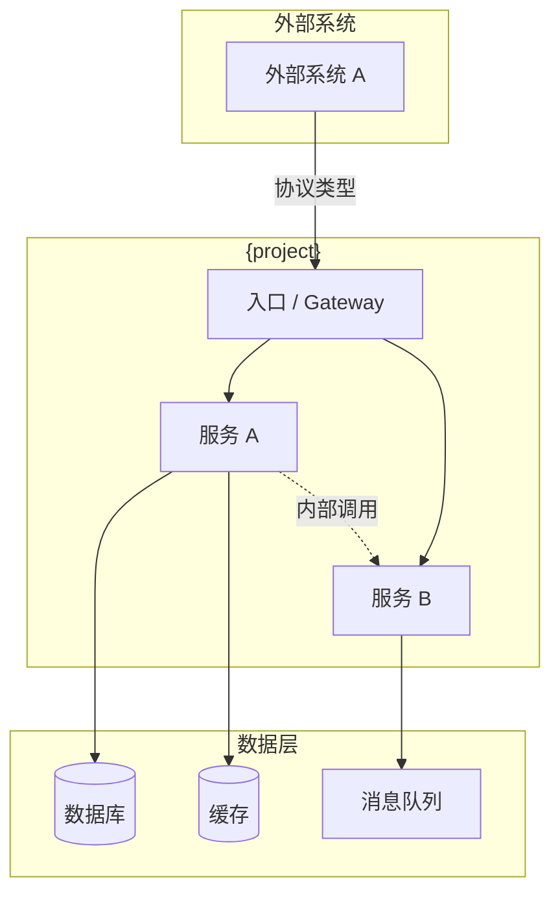
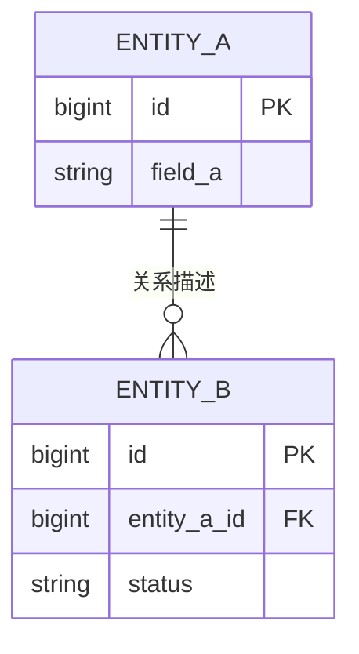
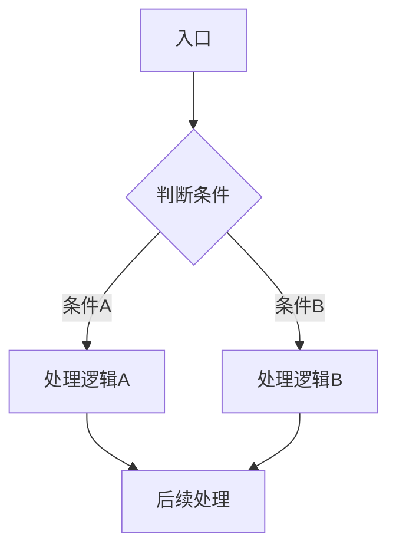
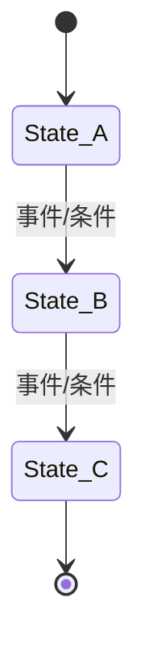
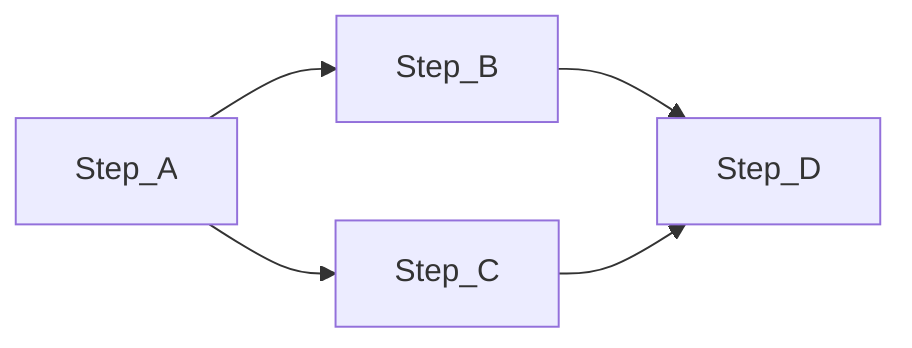
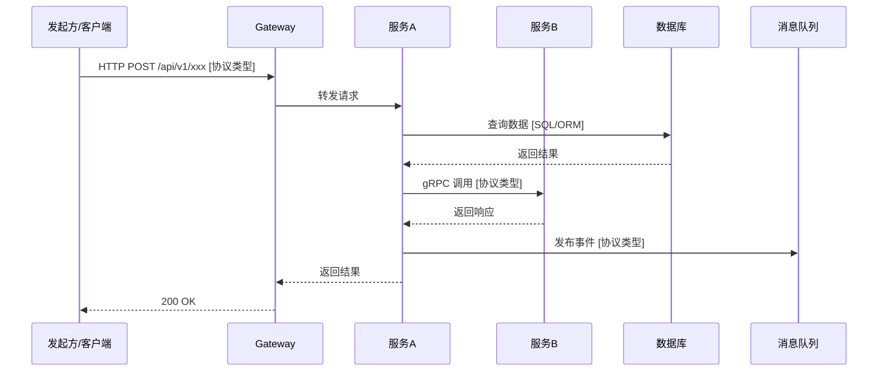
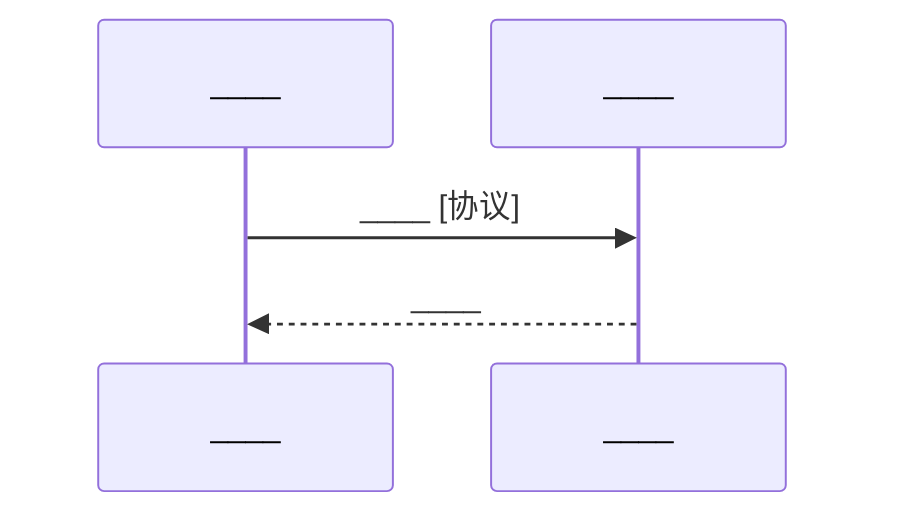

# {文档标题} - 后端架构设计

> **模板说明**：本模板输出为**分片文档**（一组独立文件），而非单个长文档。
> 每个分片文档可独立供 AI coding agent 消费，控制上下文大小。
>
> **前置条件**：必须提供 BRD/PRD 父文档作为输入。

---

## 📚 前置知识

**是否有 BRD/PRD 父文档？**

本模板用于后端架构设计，必须基于已有的业务需求和产品需求文档。如果尚未创建 BRD/PRD，请先使用 `brd_prd` 或 `all_in_one` 模板。

- **父文档路径**：[BRD/PRD 文档路径](____)
- **代码仓库**（可选）：[仓库链接](____)
- **技术栈文档**（可选）：[文档链接](____)

**[填写说明]**：
- 必须提供至少一份 BRD/PRD 父文档
- 如果是基于现有系统的扩展，同时提供代码仓库路径
- 示例：`depot/devops/dev-loop/dev-loop_project_v1.0.0.md`

---

## 🔄 分片生成工作流（spec-writer 指令）

> **spec-writer 生成本模板的分片文档时，必须遵循以下工作流**：

### 生成顺序

```
glossary → system_architecture → data_model（条件） → service_functions（多文件） → interface_protocols → system_integration → deployment → test_verification → additional_plans（条件） → faq
```

### 条件分片跳过规则

生成每个分片前，先检查 `shards` 定义中的 `condition` 字段：

1. 读取该分片的 `condition` 描述，结合 PRD 和 system_architecture 的内容判断是否满足条件
2. **满足条件** → 正常生成分片文件，`metadata.json` 中 status 设为 `complete`
3. **不满足条件** → 跳过文件生成，`metadata.json` 中 status 设为 `skipped`，`file` 字段记录为 `null`
4. 向用户确认跳过决定（一次性列出所有跳过的分片及原因）

当前条件分片：

| 分片 ID | 条件 | 典型跳过场景 |
|---------|------|------------|
| `data_model` | 有状态服务（存在持久化数据存储） | 无状态服务：纯计算、代理转发、缓存网关 |
| `additional_plans` | 有特化需求（高可用、灾备、安全加固等） | 简单项目无特殊非功能要求 |

### 一致性校验（每生成一个分片后自动执行）

每完成一个分片后，自动对比已生成的所有分片，检查以下一致性项：

| 检查项 | 校验内容 | 不一致时的处理 |
|-------|---------|--------------|
| 服务名匹配 | 各分片中引用的服务名是否与 system_architecture 定义一致 | 暂停，提示用户确认 |
| 接口匹配 | system_integration 时序图中引用的接口是否与 interface_protocols 定义一致 | 暂停，提示用户确认 |
| 数据实体匹配 | service_functions 中引用的数据实体是否与 data_model 定义一致 | 暂停，提示用户确认 |
| 术语一致性 | 各分片中的术语是否与 glossary 定义一致 | 触发 Glossary 冲突检测流程 |
| PRD 覆盖率 | 每个分片对 PRD 用户故事的覆盖是否完整 | 生成缺口报告 |

---

═════════════════════════════════════════════════════════════════════
## 分片 1/10：全局字典（Glossary）
═════════════════════════════════════════════════════════════════════

> **输出文件**：`{project}_glossary_v{version}.md`
> **依赖**：无（第一个生成的分片）
> **定位**：整个设计文档的权威元数据，避免设计文档内容在语义上的歧义分叉

---

# {project} 术语表 v{version}

本文档是 **{project}** 后端架构设计的权威术语定义。所有设计文档中的术语以本文档为准。

## 术语定义

| 术语 | 英文标识 | 定义 | 来源 | 使用上下文 |
|------|---------|------|------|----------|
| ____ | ____ | ____ | PRD / 分片N | ____ |
| ____ | ____ | ____ | PRD / 分片N | ____ |
| ____ | ____ | ____ | PRD / 分片N | ____ |

## 缩写表

| 缩写 | 全称 | 说明 |
|------|------|------|
| ____ | ____ | ____ |
| ____ | ____ | ____ |

**[填写说明]**：
- 从 BRD/PRD 父文档中提取核心**业务术语**
- 补充技术架构引入的**技术术语**（中间件、设计模式、协议名称等）
- 每个术语必须给出明确的、**无歧义**的定义
- 约定：后续文档中首次出现术语时用 **粗体** 标注，并链接到本文档
- 本文档在后续设计过程中可随时更新补充

---

### 活文档工作流（spec-writer 指令）

> **spec-writer 生成 Glossary 时必须遵循以下工作流**：

**Step 1 — 前置创建**：从 BRD/PRD 父文档提取初始术语列表（仅名词/概念，不含动词/操作/流程），生成本文档。

**Step 2 — 实时冲突检测**：每生成一个后续分片时，自动检查该分片中的术语是否与 Glossary 一致：
- **同名不同义**：暂停生成，列出冲突项让用户选择保留哪个定义
- **同义不同名**：暂停生成，列出冲突项让用户选择统一命名

**Step 3 — 自动补充**：生成过程中发现 Glossary 未覆盖的新术语时：
- 自动添加到本文档，定义标记为 `[自动推断，待审阅]`
- 在术语来源列标注首次出现的分片

**Step 4 — 事后审阅**：全部 10 个分片生成完成后：
- 展示所有标记为 `[自动推断，待审阅]` 的新增术语
- 请用户逐条确认、修正或删除

**范围限定**：仅收录名词/概念。动词、操作、流程名称不在 Glossary 范围内。

---

═════════════════════════════════════════════════════════════════════
## 分片 2/10：系统架构定义（System Architecture）
═════════════════════════════════════════════════════════════════════

> **输出文件**：`{project}_system-architecture_v{version}.md`
> **依赖**：[术语表](./{project}_glossary_v{version}.md)
> **定位**：规模定义 + 拓扑关系，给整个系统的范围和边界定调的总设计

---

# {project} 系统架构 v{version}

> 依赖：[术语表](./{project}_glossary_v{version}.md)

## 1. 规模定义

| 维度 | 定义 | 说明 |
|------|------|------|
| 服务数量 | ____ | 单一服务 / 多服务 |
| 数据库实例 | ____ | 单库 / 多库（按需分库） |
| 中间件实例 | ____ | Kafka / Redis / ES 等（如需要） |
| 部署环境 | ____ | K8s 集群 / VM / 物理机 / 混合 |

**判断依据**：
- 单一服务 + 单库：功能边界清晰、团队规模小（1-3 人）
- 多服务 + 多库：需要独立扩展、独立部署、团队分工明确

**[填写说明]**：根据 PRD 的功能复杂度和团队规模，确定系统的整体规模。规模定义直接影响后续所有分片的设计深度。

---

## 2. 系统架构图（Architecture Block Diagram）

> 用模块拓扑图表达模块拓扑关系，给整个系统的范围和边界定调。



**[填写说明]**：
- 定义系统边界（内部 vs 外部）
- 标注模块之间的连接关系和数据流向
- 标注协议类型（HTTP / gRPC / MQ 等）
- 此图是整个后端设计的"总纲"，后续所有分片都围绕此图展开

---

## 3. 模块职责定义

| 模块 | 职责 | 关键依赖 | 对外暴露 |
|------|------|---------|---------|
| ____ | ____ | ____ | 是（外部接口）/ 否（内部模块） |
| ____ | ____ | ____ | ____ |

---

## 4. 架构选型推荐（spec-writer 指令）

> **spec-writer 在填写"规模定义"和"模块职责"时，应主动推荐架构方案和技术栈。**
> **推荐依据**：PRD 业务场景 + 负载指标（QPS/并发/响应时间/持久化周期）。
> **允许使用 WebSearch** 获取最新技术方案和案例。

### 推荐输出格式（必须遵循）

**主推荐方案**：

| 维度 | 推荐方案 | 推荐依据（PRD 指标） |
|------|---------|---------------------|
| 语言 | ____ | ____（如：PRD 要求 QPS > 10K → Go 的高并发优势） |
| 框架 | ____ | ____ |
| 数据库 | ____ | ____ |
| 消息队列 | ____（如需要） | ____ |
| 缓存 | ____（如需要） | ____ |

**置信度**：高 / 中 / 低

**备选方案（至少 1 个）**：

| 维度 | 备选方案 | 与主推荐的差异 |
|------|---------|--------------|
| ____ | ____ | ____ |

**权衡分析**：

| 维度 | 主推荐 | 备选 | 优势方 |
|------|--------|------|--------|
| 实现成本 | ____ | ____ | ____ |
| 验证成本 | ____ | ____ | ____ |
| 运维成本 | ____ | ____ | ____ |
| 生态支持 | ____ | ____ | ____ |

**用户交互**：推荐后，用户可以**接受** / **调整** / **拒绝**。

---

═════════════════════════════════════════════════════════════════════
## 分片 3/10：数据模型定义（Data Model）
═════════════════════════════════════════════════════════════════════

> **输出文件**：`{project}_data-model_v{version}.md`
> **依赖**：[系统架构](./{project}_system-architecture_v{version}.md) | [术语表](./{project}_glossary_v{version}.md)
> **条件**：仅适用于**有状态服务/系统**（存在持久化数据存储），无状态服务跳过本分片
> **定位**：ER关系图描述数据实体间拓扑关系；在数据层定义和验证 PRD 用户故事的业务流程

---

# {project} 数据模型 v{version}

> 依赖：[系统架构](./{project}_system-architecture_v{version}.md) | [术语表](./{project}_glossary_v{version}.md)
>
> **适用条件**：本系统/服务存在持久化数据存储。如果是无状态服务（纯计算、代理转发等），跳过本文档。

## 1. 存储选型

| 数据类型 | 存储方案 | 选型理由 |
|---------|---------|---------|
| 业务数据 | ____（PostgreSQL / MySQL / MongoDB） | ____ |
| 缓存数据 | ____（Redis / Memcached） | ____ |
| 日志/事件 | ____（Kafka / ES / 文件） | ____ |

---

## 2. ER 关系图

> 描述数据实体间的拓扑关系



**[填写说明]**：
- 从 PRD 用户故事中提取核心数据实体
- 定义实体间的关联关系（一对一 / 一对多 / 多对多）
- 每个实体标注主键（PK）和外键（FK）

---

## 3. 数据表定义（DDL 级别）

### {table_name}

**用途**：____

```sql
CREATE TABLE {table_name} (
    id          BIGSERIAL PRIMARY KEY,
    -- 字段定义：字段名 类型 约束
    created_at  TIMESTAMPTZ NOT NULL DEFAULT NOW(),
    updated_at  TIMESTAMPTZ NOT NULL DEFAULT NOW()
);

-- 索引
-- CREATE INDEX idx_{table}_{column} ON {table_name} ({column});

-- 分区策略（如需要）
-- PARTITION BY RANGE (created_at);
```

**[填写说明]**：每个核心表提供 DDL 级别的定义。包含字段名、类型、约束（NOT NULL / UNIQUE / CHECK）、默认值。

---

## 4. 业务流程验证

> 在数据层定义和验证 PRD 用户故事的业务流程

| PRD 用户故事 | 涉及的数据实体 | 数据层验证点 | 验证方式 |
|-------------|-------------|------------|---------|
| ____ | ____ | ____ | 唯一性约束 / 外键约束 / 应用层校验 |
| ____ | ____ | ____ | ____ |

**[填写说明]**：
- 确保 PRD 中定义的每个用户故事，在数据层都有对应的支撑
- 如果发现用户故事无法在数据层验证，说明数据模型不完整
- 建议按 PRD 的核心业务流程逐个验证

---

═════════════════════════════════════════════════════════════════════
## 分片 4/10：服务功能定义（Service Functions）
═════════════════════════════════════════════════════════════════════

> **输出文件**：`{project}_service-{service_name}_v{version}.md`（每个服务一个文件）
> **依赖**：[系统架构](./{project}_system-architecture_v{version}.md) | [数据模型](./{project}_data-model_v{version}.md) | [术语表](./{project}_glossary_v{version}.md)
> **定位**：根据 PRD 定义工程方案选型，定义服务的通用设计模式和领域设计模式
>
> **重要原则**：PRD 功能模块划分**不是简单映射**到服务模块的设计，需要在工程边界定义上体现抽象、封装、复用。

---

# {project} - {service_name} 服务设计 v{version}

> 依赖：[系统架构](./{project}_system-architecture_v{version}.md) | [术语表](./{project}_glossary_v{version}.md)

## 1. 工程方案选型

根据 PRD 定义的用户故事、业务流程、功能性/非功能性指标，确定工程方案选型。

| 维度 | 选型 | 选型理由 |
|------|------|---------|
| 语言 | ____ | ____ |
| 框架 | ____ | ____ |
| 数据库驱动 | ____ | ____ |
| 消息队列客户端 | ____ | ____（如需要） |

### 选型评估

| 评估维度 | 评分（1-5） | 说明 |
|---------|-----------|------|
| **实现成本** | ____ | 开发难度、工期影响 |
| **验证成本** | ____ | 测试难度、可调试性 |
| **运维成本** | ____ | 部署复杂度、监控难度 |
| **生态支持** | ____ | 社区活跃度、文档质量、第三方库丰富度 |

**[填写说明]**：选型原则 = 实现成本 + 验证成本 + 运维成本 + 技术栈生态支持。优先选择团队熟悉的技术栈。如果有多种备选方案，列出对比分析。

---

### 选型推荐（spec-writer 指令）

> **spec-writer 在填写"工程方案选型"时，应主动推荐技术方案。**
> **推荐依据**：PRD 用户故事 + 服务特性 + 非功能指标。
> **允许使用 WebSearch** 获取最新技术方案和案例。

### 推荐输出格式（必须遵循）

**主推荐方案**：

| 维度 | 推荐方案 | 推荐依据（PRD 指标） |
|------|---------|---------------------|
| 语言 | ____ | ____ |
| 框架 | ____ | ____ |
| 数据库驱动 | ____ | ____ |

**置信度**：高 / 中 / 低

**备选方案**：____（至少 1 个，格式同上）

**权衡分析**：

| 维度 | 主推荐 | 备选 | 优势方 |
|------|--------|------|--------|
| 实现成本 | ____ | ____ | ____ |
| 验证成本 | ____ | ____ | ____ |
| 运维成本 | ____ | ____ | ____ |
| 生态支持 | ____ | ____ | ____ |

**用户交互**：接受 / 调整 / 拒绝。

---

## 2. PRD 功能→服务模块映射

> **重要**：PRD 功能模块划分不是简单映射到服务模块。需要在工程边界上体现抽象、封装、复用。

| PRD 用户故事 / 功能 (US-xxx / F-xxx) | 服务模块 | 模块职责 | 复用边界 |
|--------------------------------------|---------|---------|---------|
| ____ | ____ | ____ | 公共模块 / 服务私有 |
| ____ | ____ | ____ | ____ |

**[填写说明]**：
- 一个 PRD 功能可能拆分为多个服务模块（体现抽象）
- 一个服务模块可能服务于多个 PRD 功能（体现复用）
- 明确每个模块是"公共模块"还是"服务私有"

---

## 3. 通用设计模式

> 为了表达多个服务、模块之间的工作流程关系，用**工作流程图（Flowchart）**描述工程角度的业务流程。

### 业务流程图



| 步骤 | 处理逻辑 | 关键决策 | 异常处理 |
|------|---------|---------|---------|
| A | ____ | ____ | ____ |
| B | ____ | ____ | ____ |

**[填写说明]**：从工程角度描述业务流程，关注模块间协作和数据处理逻辑，而非 PRD 的用户视角。人机共建：AI 生成初版流程图，用户确认或调整。

---

## 4. 领域设计模式（选填）

> 根据服务特性选择合适的设计模式。可多选，也可不选。

### 4.1 生命周期管理 — 固定状态机（Fixed State Machine）

**适用条件**：服务需要对资源**全生命周期托管**时启用。

> 约定"**点**"（状态定义/识别）和"**边**"（状态跳变条件），拉通设计和代码实现。



**状态定义（点）**：

| 状态 | 定义/识别方式 | 业务含义 | 数据层标记 |
|------|-------------|---------|----------|
| State_A | ____ | ____ | ____ |

**状态跳变（边）**：

| 当前状态 | 目标状态 | 跳变条件 | 触发方 | 副作用 |
|---------|---------|---------|--------|--------|
| State_A | State_B | ____ | ____ | ____ |

**[填写说明]**：
- 每个状态必须有明确的**识别方式**（如何知道当前处于该状态）
- 每条边必须有明确的**跳变条件**（什么触发状态变更）
- 状态机定义应能直接映射到代码实现

---

### 4.2 工作流管理 — 有向无环图（DAG）

**适用条件**：服务涉及多步骤流程编排，步骤间有依赖关系时启用。



**节点定义**：

| 节点 | 职责 | 前置依赖 | 输入 | 输出 |
|------|------|---------|------|------|
| Step_A | ____ | 无 | ____ | ____ |
| Step_B | ____ | Step_A | ____ | ____ |
| Step_C | ____ | Step_A | ____ | ____ |
| Step_D | ____ | Step_B, Step_C | ____ | ____ |

**失败策略**：
- 单节点重试：____
- 从断点恢复：____
- 全部重跑：____

**[填写说明]**：
- DAG 中不能有环（循环依赖）
- 每个节点的输出应作为下游节点的输入
- 必须定义失败重试策略

---

═════════════════════════════════════════════════════════════════════
## 分片 5/10：接口协议定义（Interface Protocols）
═════════════════════════════════════════════════════════════════════

> **输出文件**：`{project}_api-spec_v{version}.md`
> **依赖**：[服务设计](./{project}_service-*.md) | [术语表](./{project}_glossary_v{version}.md)
> **定位**：区分内/外接口协议，定义协议类型，验证协议栈是否足够覆盖 PRD 的用户故事

---

# {project} 接口协议 v{version}

> 依赖：[服务设计](./{project}_service-*.md) | [术语表](./{project}_glossary_v{version}.md)

## 1. 接口分类

| 类别 | 协议类型 | 适用范围 | 认证方式 |
|------|---------|---------|---------|
| **外部接口** | ____（HTTP/REST / GraphQL） | 对外暴露给客户端/第三方 | ____ |
| **内部接口** | ____（gRPC / HTTP / Thrift） | 服务间内部调用 | ____ |
| **事件接口** | ____（Kafka / RabbitMQ / Redis Stream） | 异步事件通知 | ____ |

**[填写说明]**：
- 外部接口：面向客户端/第三方，需要考虑版本管理、限流、认证
- 内部接口：面向内部服务，关注性能和可靠性
- 事件接口：面向异步解耦，关注消息格式和幂等性

---

### 协议选型推荐（spec-writer 指令）

> **spec-writer 在填写"接口分类"时，应主动推荐接口协议方案。**
> **推荐依据**：PRD 交互模式 + 性能要求 + 团队技术栈。
> **允许使用 WebSearch** 获取最新技术方案和案例。

### 推荐输出格式（必须遵循）

**主推荐方案**：

| 接口类别 | 推荐协议 | 推荐依据（PRD 指标） |
|---------|---------|---------------------|
| 外部接口 | ____（HTTP/REST / GraphQL / gRPC-Gateway） | ____ |
| 内部接口 | ____（gRPC / HTTP / Thrift） | ____ |
| 事件接口 | ____（Kafka / RabbitMQ / Redis Stream） | ____ |

**置信度**：高 / 中 / 低

**备选方案**：____（至少 1 个）

**权衡分析**：

| 维度 | 主推荐 | 备选 | 优势方 |
|------|--------|------|--------|
| 开发效率 | ____ | ____ | ____ |
| 性能表现 | ____ | ____ | ____ |
| 可维护性 | ____ | ____ | ____ |
| 工具链成熟度 | ____ | ____ | ____ |

**用户交互**：接受 / 调整 / 拒绝。

---

## 2. 接口清单

### 外部接口

| 接口编号 | Method | Path | 入参 | 出参 | 事务内容 | 对应 PRD 故事 |
|---------|--------|------|------|------|---------|-------------|
| API-001 | POST | /api/v1/xxx | ____ | ____ | ____ | US-001 |
| API-002 | GET | /api/v1/xxx/{id} | ____ | ____ | ____ | US-002 |

### 内部接口

| 接口编号 | 协议 | 调用方 | 提供方 | 请求体 | 响应体 |
|---------|------|--------|--------|--------|--------|
| RPC-001 | gRPC | ServiceA | ServiceB | ____ | ____ |

### 事件接口

| 事件编号 | Topic/Channel | 发布方 | 订阅方 | 消息格式 |
|---------|--------------|--------|--------|---------|
| EVT-001 | ____ | ____ | ____ | ____ |

**[填写说明]**：接口上体现的是**事务内容**（这个接口在做什么业务操作），不是简单的 CRUD 描述。

---

## 3. 协议覆盖率分析

> 验证当前定义的协议栈是否足够覆盖 PRD 的用户故事（或某一个环节）

| PRD 用户故事 | 覆盖的接口 | 覆盖环节 | 是否完整 | 缺口说明 |
|-------------|----------|---------|---------|---------|
| US-001 | API-001 | 完整流程 | ✅ | - |
| US-002 | ____ | ____ | ❌ | ____ |

**[填写说明]**：
- 每个用户故事必须在接口层有对应覆盖
- 如果发现用户故事没有对应的接口，说明接口定义不完整
- 不仅要覆盖"正常流程"，也要考虑"异常/回退流程"

---

## 4. 错误码定义

| 错误码 | 含义 | HTTP Status / gRPC Code | 处理建议 |
|-------|------|------------------------|---------|
| ____ | ____ | ____ | ____ |

---

═════════════════════════════════════════════════════════════════════
## 分片 6/10：系统集成方案（System Integration）
═════════════════════════════════════════════════════════════════════

> **输出文件**：`{project}_integration_v{version}.md`
> **依赖**：[接口协议](./{project}_api-spec_v{version}.md) | [系统架构](./{project}_system-architecture_v{version}.md)
> **定位**：定义后端系统中发起方/事件源、服务、数据库、中间件之间如何协同，用时序图定义各方职责和工作过程

### 图表使用原则（spec-writer 指令）

> **本分片的图表选型原则**：根据章节需要选择合适的图表类型。

| 图表类型 | 适用章节 | 使用场景 |
|---------|---------|---------|
| **局部架构框图（Block Diagram）** | 集成点定义、多系统协同拓扑 | 展示集成范围内的模块拓扑和数据流向，聚焦参与方和连接关系而非时序 |
| **时序图（Sequence Diagram）** | 系统交互时序、关键时序场景 | 展示参与方之间的调用顺序、协议交互、响应/回调关系 |

**选型判断**：
- 需要表达"谁和谁连接、走什么协议"→ **架构框图**
- 需要表达"先调用谁、后调用谁、返回什么"→ **时序图**
- 复杂场景可两者配合使用：先用框图定拓扑，再用时序图定交互

---

# {project} 系统集成 v{version}

> 依赖：[接口协议](./{project}_api-spec_v{version}.md) | [系统架构](./{project}_system-architecture_v{version}.md)

## 1. 系统交互时序图

> 定义后端系统中 发起方/事件源、服务、数据库、中间件之间如何协同，在时序上如何工作。
> 用时序图定义各方职责、工作过程、协议交互的类型/内容。



**[填写说明]**：
- 参与者包括：发起方/事件源、服务、数据库、中间件
- 每条消息标注协议类型和内容
- 覆盖正常流程和关键异常流程

---

## 2. 集成点定义

| 集成点 | 参与方（A → B） | 协议类型 | 数据格式 | 错误处理策略 |
|-------|----------------|---------|---------|------------|
| ____ | ____ | HTTP / gRPC / MQ | JSON / Protobuf | 超时重试 / 降级 / 死信队列 |

---

## 3. 关键时序场景

> 针对每个关键业务场景，单独定义时序图

### 场景 1：____



**[填写说明]**：每个 PRD 的核心用户故事至少对应一个时序场景

---

═════════════════════════════════════════════════════════════════════
## 分片 7/10：部署方案设计（Deployment）
═════════════════════════════════════════════════════════════════════

> **输出文件**：`{project}_deployment_v{version}.md`
> **依赖**：[系统架构](./{project}_system-architecture_v{version}.md)
> **定位**：除了代码实现，定义单个服务如何编译、交付、发布（到环境）的方案

### 图表使用原则（spec-writer 指令）

> **本分片的图表选型原则**：部署方案需要图表辅助表达环境拓扑和发布流程。

| 图表类型 | 适用章节 | 使用场景 |
|---------|---------|---------|
| **部署架构框图（Deployment Block Diagram）** | 部署拓扑 | 展示组件在环境中的物理分布：节点、副本、资源配额、网络分区、存储挂载 |
| **工作流图（Flowchart）** | CI/CD 流水线、发布流程 | 展示从代码提交到环境发布的流程步骤：构建→测试→部署→验证 |
| **时序图（Sequence Diagram）** | 多环境协同发布、蓝绿/金丝雀部署 | 展示发布过程中各组件（CI Runner、镜像仓库、K8s API、负载均衡器）的交互时序 |

**选型判断**：
- 需要表达"部署在哪里、几个副本、怎么互通"→ **架构框图**
- 需要表达"先做什么、后做什么、失败怎么办"→ **工作流图**
- 需要表达"谁触发谁、请求/响应顺序"→ **时序图**（建议在蓝绿发布、金丝雀发布等复杂发布策略时使用）

---

# {project} 部署方案 v{version}

> 依赖：[系统架构](./{project}_system-architecture_v{version}.md)

## 1. 编译构建

| 组件 | 构建工具 | 构建产物 | Base Image |
|------|---------|---------|-----------|
| {service_name} | Docker multi-stage build | Docker Image | ____（用户确认） |

---

## 2. 部署拓扑

| 组件 | 部署方式 | 副本数 | 资源配额 | 配置管理 |
|------|---------|--------|---------|---------|
| {service_name} | Deployment | 2（生产最低） | CPU: 500m / Memory: 512Mi | ConfigMap + Secret |

---

## 3. CI/CD 流水线

| 阶段 | 触发条件 | 执行动作 | 产物 |
|------|---------|---------|------|
| Build | push to branch | Docker build + 单元测试 | Docker Image (tag: commit SHA) |
| Stage | MR merged | Helm deploy to Staging | Helm Release |
| Prod | Tag created | Helm deploy to Production | Helm Release |

**[填写说明]**：定义从代码提交到环境发布的完整流程。默认使用 Helm 管理 K8s 部署，用户可按需调整。

---

## 4. 环境配置

| 环境名称 | 用途 | 部署方式 | 数据源 | 特殊配置 |
|---------|------|---------|--------|---------|
| Development | 本地开发调试 | docker-compose（单服务）或 k3s（多服务） | 开发数据库 / SQLite | Debug 模式，热重载 |
| Staging | 集成测试 | K8s + Helm | 测试数据库 | 接近生产配置 |
| Production | 正式环境 | K8s + Helm | 生产数据库 | 性能优化配置，HPA 自动扩缩 |

**[填写说明]**：默认值基于 K8s + Helm 生产环境 + docker-compose/k3s 本地环境。用户可按需调整部署方式和资源配额。

---

═════════════════════════════════════════════════════════════════════
## 分片 8/10：测试验收方案（Test & Verification）
═════════════════════════════════════════════════════════════════════

> **输出文件**：`{project}_test-plan_v{version}.md`
> **依赖**：[服务设计](./{project}_service-*.md) | [接口协议](./{project}_api-spec_v{version}.md)
> **定位**：针对宏观的系统设计，定义测试验证方案（测试框架选型、功能/非功能测试要求与内容）

### 图表使用原则（spec-writer 指令）

> **本分片的图表选型原则**：测试方案需要图表辅助表达测试范围和测试流程。

| 图表类型 | 适用章节 | 使用场景 |
|---------|---------|---------|
| **测试架构框图（Test Block Diagram）** | 测试框架选型、功能测试 | 展示测试范围内的系统组件、Mock/Stub 注入点、测试环境边界、数据流验证路径 |
| **工作流图（Flowchart）** | 功能测试、非功能测试、测试执行流程 | 展示测试执行步骤：准备数据→调用接口→验证响应→清理数据；或测试链路：UT→IT→E2E→性能 |
| **时序图（Sequence Diagram）** | 集成测试、端到端测试场景 | 展示测试用例中多组件交互的预期时序，标注验证点（assert 点）和 Mock 边界 |

**选型判断**：
- 需要表达"测哪些组件、Mock 在哪里注入、数据怎么流转"→ **架构框图**
- 需要表达"测试步骤顺序、条件分支、失败回退"→ **工作流图**
- 需要表达"组件 A 调用组件 B，在此处断言响应"→ **时序图**（建议在集成测试、E2E 测试中按需使用）

---

# {project} 测试验收方案 v{version}

> 依赖：[服务设计](./{project}_service-*.md) | [接口协议](./{project}_api-spec_v{version}.md)

## 1. 测试框架选型

| 测试类型 | 框架/工具 | 适用范围 | 选型理由 |
|---------|----------|---------|---------|
| 单元测试 | ____ | 服务内部逻辑 | ____ |
| 集成测试 | ____ | 服务间交互 | ____ |
| E2E 测试 | ____ | 完整业务流程 | ____ |
| 性能测试 | ____ | 容量验证 | ____ |

---

## 2. 功能测试

| 测试场景 | 对应 PRD 故事 | 测试方法 | 通过标准 |
|---------|-------------|---------|---------|
| ____ | US-001 | ____ | ____ |

---

## 3. 非功能测试

| 测试类型 | 测试内容 | 目标值 | 验证方法 |
|---------|---------|--------|---------|
| 性能测试 | ____（QPS / 延迟） | ____ | 压测工具（____） |
| 安全测试 | ____ | ____ | ____ |
| 可用性测试 | ____ | ____ | 混沌工程 / 故障注入 |

---

═════════════════════════════════════════════════════════════════════
## 分片 9/10：其他附加方案（Additional Plans）
═════════════════════════════════════════════════════════════════════

> **输出文件**：`{project}_{plan_name}_v{version}.md`（可生成多个文件）
> **依赖**：[系统架构](./{project}_system-architecture_v{version}.md)
> **条件**：有特化需求时启用（稳定性、高可用、灾备、安全加固等）

---

# {project} {plan_name} v{version}

> 依赖：[系统架构](./{project}_system-architecture_v{version}.md)

## 1. 需求分析

- 为什么需要这个方案？____
- PRD 中的哪些非功能需求驱动了这个方案？____

## 2. 设计方案

____（方案详细内容）

## 3. 验证方案

____（如何验证这个方案的有效性）

**[填写说明]**：
- 本模板可复用，每个特化需求生成一个独立文件
- 常见附加方案：高可用设计、灾备方案、安全加固、性能调优、数据迁移方案
- 如果没有特化需求，跳过本分片

---

═════════════════════════════════════════════════════════════════════
## 分片 10/10：FAQ（万能补丁文档）
═════════════════════════════════════════════════════════════════════

> **输出文件**：`{project}_faq_v{version}.md`
> **依赖**：所有其他分片
> **定位**：最后一个万能补丁文档，不能归类的都塞在这里

---

# {project} FAQ v{version}

> 依赖：所有其他分片文档

本文档收集设计过程中产生的、不能归入其他分片的问题和解答。

| FAQ 编号 | 问题 | 回答 | 相关文档 |
|---------|------|------|---------|
| FAQ-001 | ____ | ____ | [链接](./xxx.md) |
| FAQ-002 | ____ | ____ | ____ |

**[填写说明]**：
- 在设计过程中随时记录问题和决策
- 不能归入其他分片的内容放这里
- FAQ 的价值在于记录"为什么这样设计"的决策理由

---

═════════════════════════════════════════════════════════════════════
## 📦 输出产物规范
═════════════════════════════════════════════════════════════════════

> 以下两个文件与分片文档同目录输出，由 spec-writer 自动生成和维护。

### metadata.json — 分片组目录

每组分片文档生成时，自动在分片目录下创建 `metadata.json`，描述当前分片组的完整信息。

```json
{
  "project": "{project}",
  "template_name": "hld_backend",
  "template_version": "1.0.0",
  "shard_initial_version": "0.1.0",
  "parent_document": "BRD/PRD 文档路径",
  "generated_at": "2026-05-27T10:00:00Z",
  "shards": [
    {
      "id": "glossary",
      "file": "{project}_glossary_v0.1.0.md",
      "version": "0.1.0",
      "status": "complete",
      "depends_on": []
    },
    {
      "id": "system_architecture",
      "file": "{project}_system-architecture_v0.1.0.md",
      "version": "0.1.0",
      "status": "complete",
      "depends_on": ["glossary"]
    },
    {
      "id": "data_model",
      "file": null,
      "version": null,
      "status": "skipped",
      "skip_reason": "无状态服务，不涉及持久化数据存储",
      "depends_on": ["system_architecture"]
    }
  ],
  "version_policy": "SemVer 2.0"
}
```

**字段说明**：
- `template_name` + `template_version`：模板文件自身的标识和版本（与 YAML frontmatter 的 `template_name` / `template_version` 一致）
- `shard_initial_version`：输出分片文档的初始版本（来自 `version_policy.initial_version`）
- `shards[].status`：`pending` / `in_progress` / `complete` / `skipped`
- `shards[].version`：该分片的当前语义版本，初始值取自 `shard_initial_version`；跳过分片为 `null`
- `shards[].skip_reason`：仅 `skipped` 状态时分片需要填写，说明跳过原因
- 每次生成/更新分片时，自动更新对应 shard 的 status 和 version

---

### changelog.jsonl — 迭代历史

每轮设计迭代时，在 `changelog.jsonl` 尾部追加一条 JSON 记录（JSONL 格式，每行一条）。

```json
{
  "timestamp": "2026-05-27T10:30:00Z",
  "source": "prd_change",
  "reason": "PRD 新增用户故事 US-005",
  "scope": ["service_functions", "interface_protocols", "system_integration"],
  "version_diff": {
    "service_functions": {"before": "0.1.0", "after": "0.2.0"},
    "interface_protocols": {"before": "0.1.0", "after": "0.2.0"},
    "system_integration": {"before": "0.1.0", "after": "0.2.0"}
  }
}
```

**字段说明**：
- `source`：`initial_generation` / `prd_change` / `user_modification` / `architecture_refactor`
- `scope`：受影响的分片 ID 列表
- `version_diff`：每个受影响分片的版本变更（before → after）
- **追加方式**：仅在尾部追加，不修改已有记录
